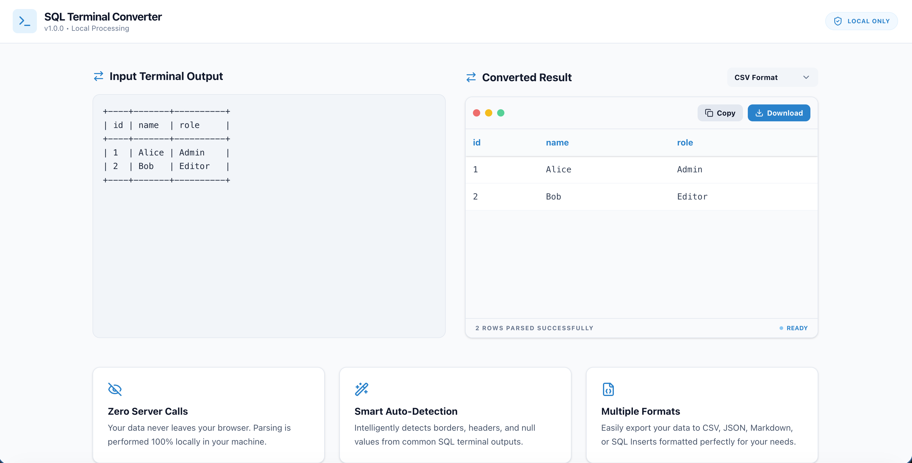

# sql-terminal-converter

Convert SQL terminal output tables into SQL, CSV, JSON, or Markdown — 100% client-side, no data uploaded.

## Features

- Parse common SQL terminal-style ASCII tables
- Convert output to **CSV**, **JSON**, **Markdown**, or **SQL INSERT**
- Copy converted result in one click
- Download converted file locally
- Privacy-first: all parsing and conversion runs in your browser

## Quick Start

### Prerequisites

- Node.js 20+

### Install

```bash
npm install
```

### Run (development)

```bash
npm run dev
```

Open the app at the local URL shown in terminal (default: `http://localhost:3000`).

### Build

```bash
npm run build
```

### Preview production build

```bash
npm run preview
```

## Example Input

```text
+----+-------+----------+
| id | name  | role     |
+----+-------+----------+
| 1  | Alice | Admin    |
| 2  | Bob   | Editor   |
+----+-------+----------+
```

*convert result*

## Tech Stack

- React + TypeScript
- Vite
- Tailwind CSS

## Privacy

This tool runs entirely on the client side. Your pasted table data is processed locally in the browser and is not uploaded.
